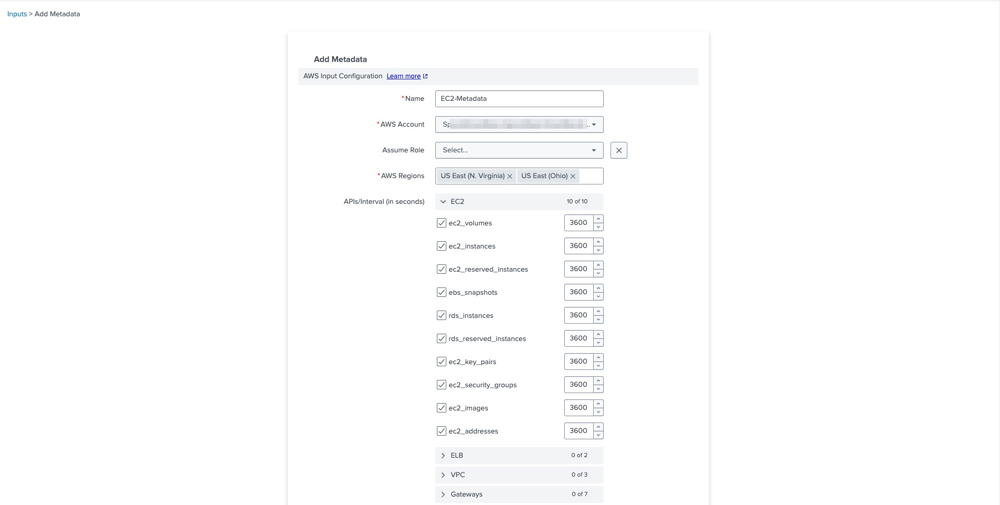
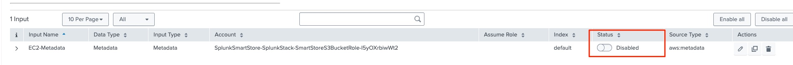
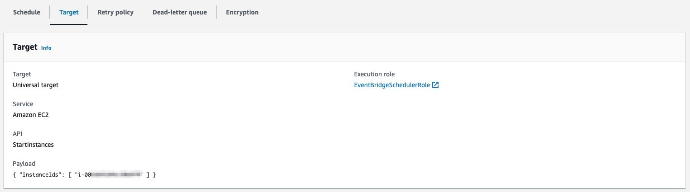
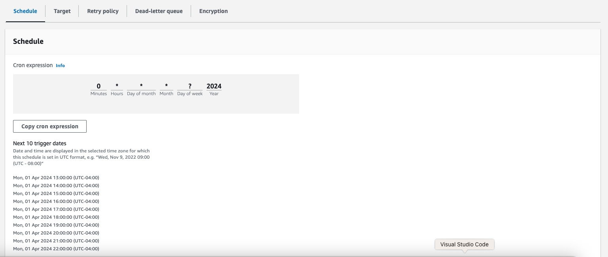

# splunk-ec2-metadata-scheduler
### How to Schedule EC2 metadata collection from AWS Add-on app on a Splunk Heavy Forwarder 
#### Requirement: 
Customers poll [AWS metadata](https://docs.splunk.com/Documentation/AddOns/released/AWS/Metadata) to poll various metadata info from AWS services like EC2, RDS, ELS, ELBs etc. This can be scheudled in the AWS Add-on App for poll frequency. Some customers want this to be polled on a given interval using some scheduling solutions, rather than having an Forwarder instance running 24x7. This beneifts to save cost on forwarder instance consumption. The steps outlined he can be deployed to achieve this solution

#### Step 1: Configure your Add-On App
- Setup a Splunk Heavy forwarder instance with latest version of [AWS Add-on App](https://splunkbase.splunk.com/app/1876) installed. 
- Setup the forwarding to your indexers.
- Create an [IAM role for EC2](https://docs.aws.amazon.com/AWSEC2/latest/UserGuide/iam-roles-for-amazon-ec2.html) and include the policies outlined in the [AWS metadata](https://docs.splunk.com/Documentation/AddOns/released/AWS/Metadata) configuration.
- Create an input for Metadata entries for EC2 and others. You can see EC2 instance role you created in previous step appearing in the AWS Account input, select this and include which AWS regions you would want this input to poll. Select the appropriate APIs.
  
- Add the input and once added, check the status to be disabled.
  
- SSH into the Forwarder instance and check the input configuration file at `/opt/splunk/etc/apps/Splunk_TA_aws/local/aws_metadata_tasks.conf`. You should see an entry something as below (Your actual entries may be different depending on number inputs and regions you've selected). The last line indicates this input is currently in disabled state.
```
[EC2Metadata]
account = SplunkSmartStore-SplunkStack-SmartStoreS3BucketRole-I5yOXrbiwWt2
apis = ec2_volumes/3600,ec2_instances/3600,ec2_reserved_instances/3600,ebs_snapshots/3600,rds_instances/3600,rds_reserved_instances/3600,ec2_key_pairs/3600,ec2_security_groups/3600,ec2_images/3600,ec2_addresses/3600
index = default
regions = us-east-2,us-east-1
retry_max_attempts = 5
sourcetype = aws:metadata
disabled = 1
```
#### Step 2: Setup SNS Topic for Notification (Optional)
- Perform the below steps to setup a SNS topic to notify the scheduled script. 
- Follow the steps outlined in AWS documentation to create a [SNS Topic and email subscription](https://docs.aws.amazon.com/sns/latest/dg/sns-getting-started.html)
- Note down the SNS topic ARN

#### Step 3: Setup shell script
- Copy the `splunk_aws_ta.sh` shell script to a local directory in Forwarder instance. Change the permission of the script to execute mode.
  `chmod +x splunk_aws_ta.sh`
- Review this script and edit line 23 to update the count to match number of entries based on your input configuration. This will be the number of APIs you selected times the number regions. For example if you selected all 10 EC2 metadata APIs and selected 2 regions as in example conf file shown in previous step, then your entry will be 10 x = 20. Based on this calculation, update the number at `-ge 20` to your number other than 20.
  `until [ $(cat /opt/splunk/var/log/splunk/splunk_ta_aws_metadata.log  | grep "End of collecting description data" | wc -l) -ge 20 ]`
- Update the SNS topic ARN in line 33 with your SNS topic ARN. If you dont plan to use SNS topic, then comment this line and include your code for notification.
- `$(aws sns publish --topic-arn arn:aws:sns:us-east-1:XXXXXXXXXXXXXXXX:SplunkTestTopic`
- Edit the last line to comment the shutdown step
  `#shutdown -h now`
- Now run and test this script with sudo privilege. Once finished, check your Splunk indexers to see if the Medatadata info is ingested.
- If the scripts runs good and once you confirmed the indexed data, uncomment the last line for shutdown and move this script to `/var/lib/cloud/scripts/per-boot/` directory. This will make this script as boot script.
- Shutdown the Forwarder EC2 instance. In next step we will schedule this instance to run based on the desired frequency using EventBridge Scheduler.

#### Step 3: Schedule the instance startup
- Create an IAM role for Event Bridge Scheduler to call EC2 API for start instance with the following trust and permission policy
  - Trust Policy
    ```
    {
    "Version": "2012-10-17",
    "Statement": [
        {
            "Effect": "Allow",
            "Principal": {
                "Service": "scheduler.amazonaws.com"
            },
            "Action": "sts:AssumeRole"
        }
    ]
    }
    ```
  - Permission Policy - Change the account id to your AWS account ID, region to AWS region where forwarder instance is running and update the forwarder instance id 
    ```
    {
        "Version": "2012-10-17",
        "Statement": [
            {
                "Sid": "VisualEditor0",
                "Effect": "Allow",
                "Action": "ec2:StartInstances",
                "Resource": [
                    "arn:aws:ec2:<Instance AWS Region>:<Your AccountID>:instance/<Your Instance Id>",
                    "arn:aws:license-manager:*:<Your AccountID>:license-configuration:*"
                ]
            }
        ]
    }
    ```
 - Example Policy:
    ```
    {
        "Version": "2012-10-17",
        "Statement": [
            {
                "Sid": "VisualEditor0",
                "Effect": "Allow",
                "Action": "ec2:StartInstances",
                "Resource": [
                    "arn:aws:ec2:us-east-1:123456789012:instance/i-0001234abcd123456",
                    "arn:aws:license-manager:*:123456789012:license-configuration:*"
                ]
            }
        ]
    }
    ```
  
- Go to AWS console for [Amazon Eventbridge](https://console.aws.amazon.com/scheduler/home)
- Create a Cron based schedule to select the frequency (example for every hour) using **Recurring schedule** option and Schedule type as **Cron-based schedule**.
- Select EC2 **StartInstances** as API target and update your EC2 instance id for the input.
- Provide the IAM role you created as the Execution Role.
- Once created, your schedule and target should look like following in the AWS console
  - Target (Check your instance id of the forwarder instance)
  - 
  - Schedule (Example schedule to execute every hour)
  - 
 

#### With these steps, you are all set in scheduling this as a service using EC2 and EventBridge scheduler. Check your email for SNS notifications for execution of this script and Splunk for indexed metadata.